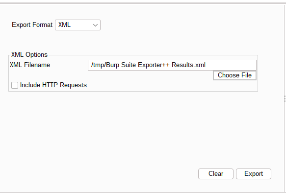
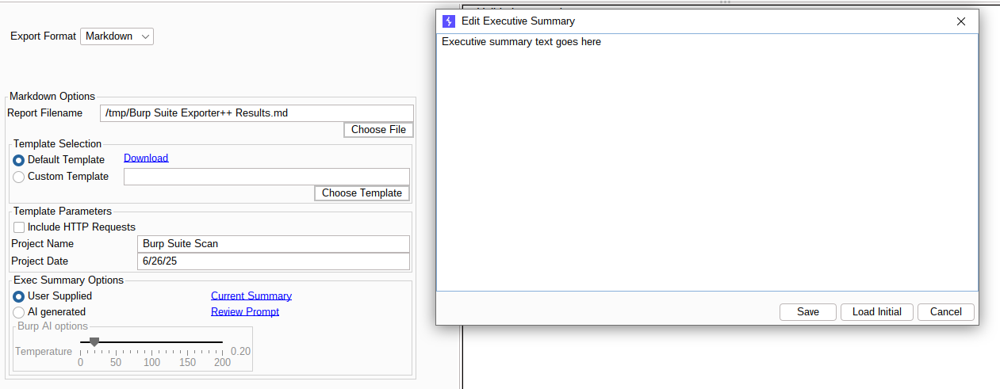

## Exporter++ Burp Suite extension
This Burp Suite extension allows the user to upload the identified security issues directly to Pwndoc or export them in various document formats.

## Features
* Export options: Pwndoc, CSV, JSON, XML, Markdown and Docx.
* Option to include also the full HTTP Requests/Responses of the Security issues.
* Custom template support for Markdown (Apache FreeMarker) or Docx (XDocReport with Apache Velocity engine).
* Only the user-selected security issues are exported
* The Security issues are sorted by severity, confidence and name

## Usage
1. In the Target Tab, select the Issues you want to export
2. Right-click and select Extensions -> Exporter++ -> Send to Exporter++
   
3. Go to the Exporter++ tab and choose the appropriate export options you want
   * Pwndoc
     
     And we see that our scan has been uploaded
     
   * CSV
     
   * JSON
     
   * XML
     
   * Markdown
     
   * Docx
     
4. Click the Export button to start the export process

